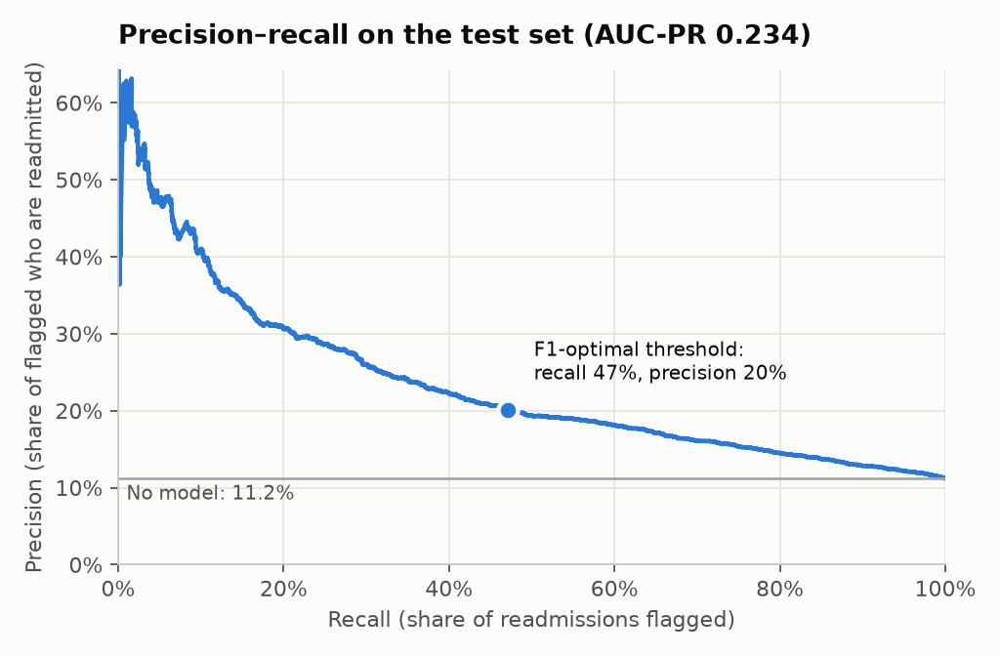
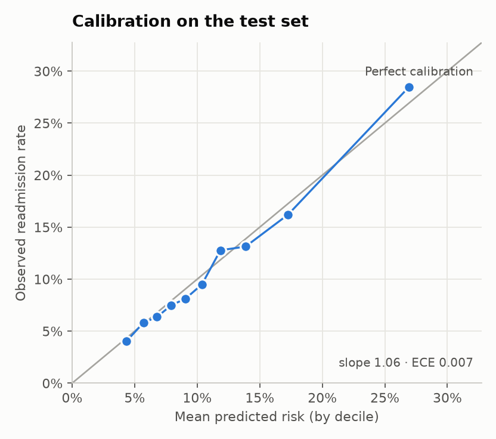
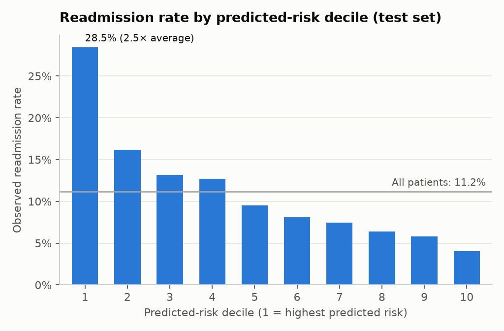
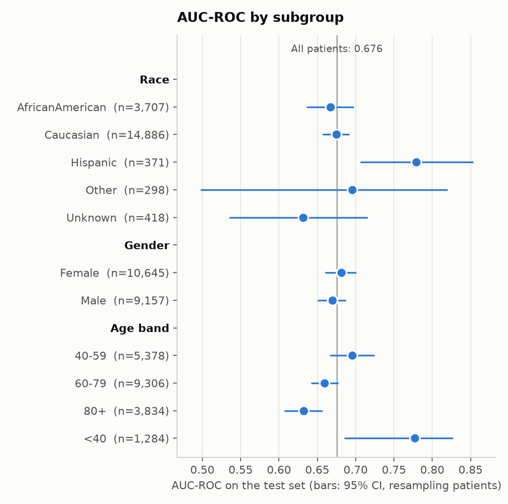

# Readmission Risk — 30-day hospital readmission for diabetic patients

> Educational project. **Not a clinical tool.**

End-to-end machine learning project: data exploration, a gradient-boosted model,
explainability (SHAP), subgroup analysis, and a containerised prediction API.

## Dataset
[Diabetes 130-US Hospitals (1999–2008)](https://archive.ics.uci.edu/dataset/296), UCI Machine
Learning Repository: ~100k hospital encounters, de-identified. The data is not committed;
it is downloaded by a script.

## Quickstart
```bash
python -m venv .venv && source .venv/bin/activate
pip install -e ".[dev]"
python scripts/download_data.py
pytest
python -m readmission.train      # compares models with patient-level CV, saves models/model.joblib
python -m readmission.evaluate   # opens the test set ONCE; writes tables and figures to reports/
```

## Project status
- [x] Repo skeleton, data download, CI
- [x] EDA
- [x] Cleaning and features
- [x] Modelling (baseline + LightGBM)
- [x] Evaluation (AUC-PR, calibration, threshold, subgroups)
- [ ] Explainability (SHAP)
- [ ] API (FastAPI) + Docker
- [ ] Final README: results, limitations

## Test-set results
Hold-out test set: 19,802 encounters from patients never seen in training. 95% intervals come from
resampling patients, not rows.

| Metric | Value (95% CI) |
|---|---|
| AUC-ROC | 0.676 (0.660–0.690) |
| AUC-PR (random = 0.112) | 0.234 (0.211–0.257) |
| Brier score | 0.094 (0.090–0.098) |
| Readmission rate in the 10% highest-risk patients | 28.5% vs. 11.2% overall (lift 2.5×) |
| Share of all readmissions found in that 10% | 25% (top 30%: 51%) |

Operating points (threshold chosen on out-of-fold predictions over the training set):

| Rule | Patients flagged | Precision | Recall |
|---|---|---|---|
| Top 10% highest risk (threshold 0.197) | 9.7% | 28.6% | 24.9% |
| F1-optimal (threshold 0.135) | 26.2% | 20.1% | 47.1% |

Calibration is good (slope 1.06, expected calibration error 0.007): a predicted 20% risk
corresponds to about 20% of those patients being readmitted.

**Subgroups.** No meaningful difference by gender or between the two large race groups
(African American AUC-ROC 0.667 vs. Caucasian 0.675, overlapping intervals); smaller race groups
have too few cases to conclude anything. Discrimination is clearly lower in patients aged 80+
(0.632) than under 40 (0.777). Full tables and figures are in `reports/`.






## Design decisions
- Binary target: readmitted in < 30 days vs. everything else.
- Train/test split **by patient** (`patient_nbr`) to avoid leakage between encounters.
- `race` is excluded from the features and used only for subgroup performance analysis.

## Limitations
_To be completed._